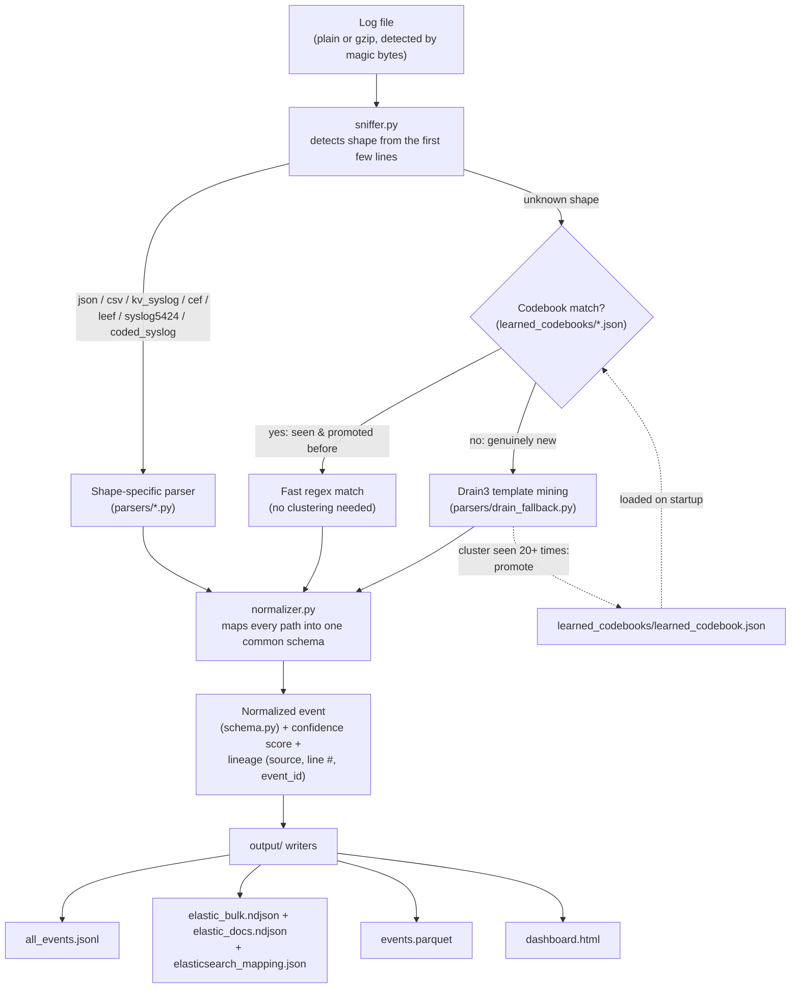
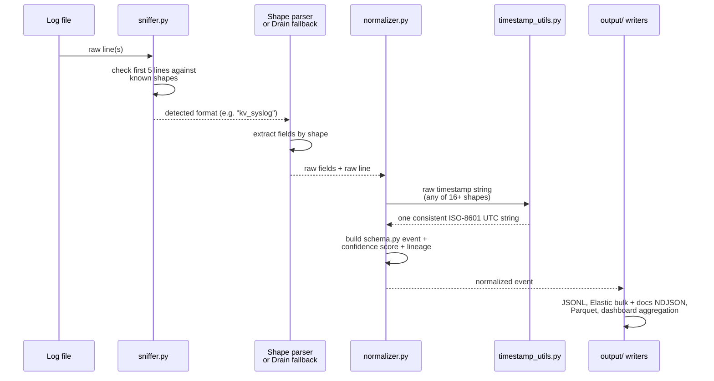
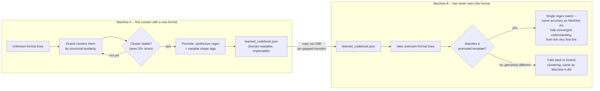
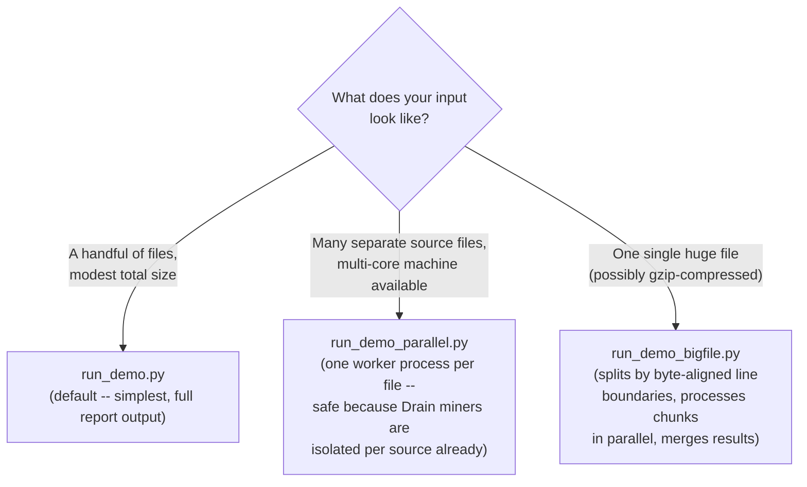

# ULPF — Universal Log Parsing Framework

**Offline. Air-gapped. Zero LLM calls. Feeds straight into Elastic or Splunk.**

A format-agnostic log ingestion pipeline that normalizes wildly different log
sources — firewalls, cloud flow logs, supercomputer logs, Android
logcat — into one common schema, without writing a parser per vendor. Nine
shapes are recognized directly; anything else falls through to a
statistical fallback that has never seen the format before and still parses
it, with zero source-specific code. Formats it learns are remembered
permanently and can be carried to another air-gapped machine as a single
JSON file.


---

## Contents

- [Why this exists](#why-this-exists)
- [How it works](#how-it-works)
- [A single log line's journey](#a-single-log-lines-journey)
- [Self-writing parser codebooks](#self-writing-parser-codebooks)
- [Scaling to GB-size input](#scaling-to-gb-size-input)
- [Running it](#running-it)
- [Output files](#output-files)
- [Requirements checklist](#requirements-checklist)
- [Project structure](#project-structure)
- [Known limitations](#known-limitations)

---

## Why this exists

Every log source encodes roughly the same information (source/destination
IP, port, protocol, action, timestamp) in a different syntax. The usual
answer to that is writing a parser per vendor — a Fortinet parser, a Cisco
parser, an AWS parser — which means every new source is a standing
engineering task, forever, repeated per SIEM you own.

This project parses by **shape** instead: JSON, CSV, key=value, CEF, LEEF,
RFC 5424 structured syslog, and vendor-coded syslog are each handled by one
shape extractor that doesn't care which vendor emits it. A new vendor that
happens to emit an already-supported shape needs **zero new code**. A
source that matches *none* of those shapes still gets parsed — via
statistical template mining, not a hand-written pattern — and once that
shape has been seen enough times, it's promoted into a permanent,
inspectable parser of its own.

Everything runs with no network access at any point, which is the actual
requirement for air-gapped SOC/defense environments this was built for —
not a stylistic choice.

## How it works



Two families of "known knowledge" feed into this, both stored as plain JSON
data rather than code:

- **`codebooks/*.json`** — hand-curated vendor message-code tables (e.g.
  Cisco ASA's `%ASA-4-106023`, Cisco Firepower's `%FTD-6-430001`). Adding a
  new coded-syslog vendor means adding a JSON file, not new Python.
- **`learned_codebooks/*.json`** — auto-generated by the pipeline itself
  from stable Drain clusters. See [Self-writing parser
  codebooks](#self-writing-parser-codebooks) below.

## A single log line's journey



The timestamp step matters more than it looks: the 25-source sample corpus
alone produces 16+ genuinely different raw timestamp shapes (`Aug 31
09:12:03`, `081109 203615`, `[10.30 16:49:06]`, bare epoch integers, ISO
with comma-decimal milliseconds...). Elasticsearch/Kibana can only build a
date histogram or a "last 24 hours" panel off a field that parses under one
consistent format — `timestamp_utils.py` is what makes every one of those
shapes land as the same strict ISO-8601 UTC value before an event ever
leaves the pipeline, including correct year-inference for the year-less
BSD-syslog shapes (assumes the most recent occurrence of that month/day
that isn't in the future).

## Self-writing parser codebooks

The Drain3 fallback re-clusters every unrecognized line from scratch, every
run — the same cost the rest of the industry pays too, just paid
differently: Splunk and Elastic don't attempt automatic clustering for a
genuinely custom source at all; a human hand-writes `props.conf` /
`transforms.conf` regex or an ingest pipeline, once per format, per SIEM.
Neither approach produces a durable, portable artifact from what's already
been learned.

Once a Drain cluster has been seen enough times to be statistically stable
(20+ occurrences), it gets **promoted**: a regex plus a per-variable shape
tag, synthesized directly from the cluster's own template. A promoted
codebook is one human-readable JSON file — inspectable, editable, never a
black box — that can be copied to a different air-gapped machine over USB
and recognizes that format there immediately, with no re-learning:



Verified on the sample corpus: **184 templates promoted** across the 15
never-seen-before formats, matching against a codebook produces output
that's either identical to or *more* accurate than a fresh, un-converged
Drain pass (an early cluster snapshot can misjudge a variable's shape
before enough examples have been seen; a promoted template reflects the
fully-converged final understanding from the start). Matching is indexed
by token count — the same first-level bucketing trick Drain3's own
tree-search already uses — so a codebook accumulated across many source
formats doesn't force every line through irrelevant templates.

## Scaling to GB-size input



All three share the same underlying pipeline and produce the same output
shape. The whole pipeline is streaming end to end — `pipeline.process_file`
is a generator, the dashboard aggregator never materializes a full event
list, and Parquet is written in fixed-size batches against an explicit
schema — memory stays flat regardless of input size. Verified: a 641MB /
2-million-line file that OOM-killed the original buffered approach outright
processes at a constant ~180MB peak memory with the current streaming
design.

`run_demo_bigfile.py` additionally handles gzip (decompresses once, since
you can't seek into an arbitrary byte offset of a compressed stream) and
CSV (the header row is read once and shared across every chunk, since it's
the schema, not a repeatable per-chunk artifact).

## Running it

```bash
pip install drain3 pyarrow

# Default: process every file in samples/, print the full report,
# write output/ (JSONL, Elastic bulk + docs NDJSON, Parquet, dashboard)
python3 run_demo.py

# Many separate source files, multi-core machine
python3 run_demo_parallel.py [num_workers]

# One single huge (optionally gzip-compressed) file
python3 run_demo_bigfile.py /path/to/huge_file.log [num_workers]

# Onboard a brand-new source before wiring it into the real pipeline --
# tells you immediately whether it needs zero code, a codebook (and
# scaffolds one automatically), or nothing at all
python3 onboard_source.py --sample /path/to/sample.log --name my-source

# Regression suite: all 25 sample formats, asserting detected format,
# a confidence floor, and correct lineage per file
python3 tests/test_pipeline.py
```

## Output files

| File | Purpose |
|---|---|
| `all_events.jsonl` | Every normalized event, one JSON object per line |
| `elastic_bulk.ndjson` | Elasticsearch/OpenSearch `_bulk` API format (action + doc line pairs); `event_id` as `_id` makes re-ingestion idempotent |
| `elastic_docs.ndjson` | Plain one-document-per-line NDJSON, for Kibana's "Upload a file" data visualizer (which rejects the `_bulk` action-line format) |
| `elasticsearch_mapping.json` | Explicit field types (`date`, `ip`, `keyword`, `integer`, `float`) — without this, dynamic mapping guesses, and a `text`-typed field like `action` can't be aggregated into a chart |
| `events.parquet` | Columnar output for data-lake platforms (S3 + Athena, Spark, Delta Lake), lineage flattened into queryable columns |
| `dashboard.html` | Self-contained visibility dashboard — inline SVG charts, searchable/sortable event table, dark/light theme, zero external dependencies |
| `learned_codebooks/learned_codebook.json` | Promoted parser templates — durable across runs, portable across machines |

## Requirements checklist

| # | Requirement | Where |
|---|---|---|
| a-c | Format-agnostic parsing, zero-code onboarding for known shapes, statistical fallback for unknown ones | `sniffer.py`, `parsers/*.py`, `parsers/drain_fallback.py` |
| d | **Traceability** — every event traces back to its exact source line | `lineage.py`: stable `event_id` (hash of source path + line number + raw line), full `lineage` block on every event |
| e | **Plug-and-play onboarding** | `registry.py` auto-records every source seen; `onboard_source.py` is a CLI to check a new source before wiring it in |
| f | **Unified visibility** | `dashboard.py` — one self-contained HTML file, no server, no external dependency |
| g | **SIEM / data lake integration** | `outputs/` — Elasticsearch bulk + plain-doc NDJSON + explicit mapping, Parquet |
| h | **Self-writing parser codebooks** (this project's differentiator vs. Splunk CIM / Elastic ECS, both of which require hand-written per-format parsers) | `codebook.py`, `learned_codebooks/` |

## Project structure

```
universal_log_parser/
├── run_demo.py                  # default entry point
├── run_demo_parallel.py         # many files, multi-core
├── run_demo_bigfile.py          # one huge file, chunked + parallel
├── bigfile_chunking.py          # byte-aligned chunk boundary logic
├── pipeline.py                  # per-source dispatch, Drain miner lifecycle
├── sniffer.py                   # shape detection
├── normalizer.py                # every shape -> one common schema
├── schema.py                    # the common event schema
├── timestamp_utils.py           # 16+ raw shapes -> one ISO-8601 UTC form
├── lineage.py                   # event_id + source traceability
├── registry.py                  # source onboarding history (file-locked)
├── onboard_source.py            # CLI for vetting a brand-new source
├── codebook.py                  # self-writing parser codebook engine
├── dashboard.py                 # HTML dashboard generator
├── parsers/
│   ├── json_flow.py / csv_parser.py / kv_syslog.py
│   ├── cef.py / leef.py / syslog5424.py
│   ├── coded_syslog.py          # vendor message-code lookup (uses codebooks/)
│   ├── generic_profiler.py      # shape-level tagging for the fallback path
│   └── drain_fallback.py        # Drain3 template mining
├── codebooks/                   # hand-curated vendor message-code tables
│   ├── cisco_asa.json
│   └── cisco_firepower.json
├── learned_codebooks/           # auto-promoted parser templates (generated)
├── outputs/
│   ├── elastic_bulk.py / elasticsearch_mapping.py / parquet_writer.py
├── tests/
│   └── test_pipeline.py
└── samples/                     # 25-source demo corpus
```

## Known limitations

- CEF/LEEF pipe-escaping (`\|` inside a field) isn't handled — fine for
  this corpus, would need a stricter tokenizer for production use.
- Coded-syslog codebooks only cover the message codes present in each
  sample file; extending them to full vendor coverage means adding more
  JSON entries from the vendor's published message reference, not new
  parsing logic.
- Fallback-path `user`/`host`/IP fields are best-effort — recovered from
  generic shape rules, not from knowing what a given source's fields
  actually mean. The raw line is always kept alongside the normalized
  fields so nothing is silently misrepresented.
- BGL/Thunderbird's date-only timestamp field normalizes to day-level
  granularity (`T00:00:00Z`), not second-level — the fuller sub-second
  timestamp those sources also carry is a separate token not currently
  extracted.
- Gzip support covers whole-file compression detected by magic bytes; it
  doesn't (yet) handle multi-stream/concatenated gzip archives, zstd, or
  bzip2.
- Each Drain miner instance is single-process; a promoted codebook's
  variable-role inference is a heuristic (shape + position), not a
  guarantee — every entry is meant to be reviewed before being trusted in
  a production deployment, which is why the format is plain inspectable
  JSON rather than a compiled/opaque artifact.
